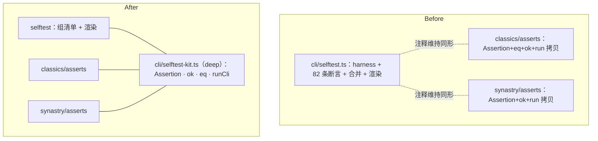

# purplestar-astrology 优化评审（2026-10-01）

> 本文档汇总两份评审：**第一部分**为架构评审（improve-codebase-architecture 流程产出，HTML 版见 [architecture-review-20261001.html](architecture-review-20261001.html)）；**第二部分**为 CLI 命令面可用性分析（实测跑通全部命令、帮助与报错路径后得出）。
>
> 评审边界：CLAUDE.md 写明的刻意设计（晚子时双口径、绊线字段、`--yearly` 语义、palaces 按 branch 序、真太阳时默认不含均时差、OPTION_OWNERSHIP 只做 help 视图、args 无默认值设计等）不作为摩擦项。仓库无 ADR 目录，判定以 CLAUDE.md 为准。

---

## 第一部分：架构评审（8 个候选）

热点依据 git log：近两周改动集中在 CLI 命令面（四命令合一、解析引擎换 `util.parseArgs`、`--config`/`--template`）与 selftest 三段合一。术语遵循 codebase-design 词汇表：module（模块）、interface（接口）、depth（深/浅）、seam（接缝）、adapter（适配器）、leverage（杠杆）、locality（局部性）。

### 候选 1 · 补上 selftest 缺失的接缝接口：抽 `selftest-kit` 　【Strong】✅ 已实施

**涉及文件**

- `scripts/cli/selftest.ts:77-130`（harness：Assertion、eq、ok 全部定义在 `cmdSelftest` 函数体内）、`:872-873`（不可达 return）、`:1071-1076`（runCli 子进程探针）、`:1256-1298`（合并与渲染）
- `scripts/classics/selftest-asserts.ts:21-60`
- `scripts/synastry/selftest-asserts.ts:23-27, 148-163`

**Problem**　selftest 的 seam 已有两个 adapter（classics 10 条、synastry 13 条断言组），但 interface 文件不存在：`Assertion`/`eq`/`ok` 三处逐字同形复制，靠"（与 cli/selftest.ts 的 Assertion 同形）"注释维持同步；`spawnSync` 子进程探针抄三份、`eq` 抄两份。主文件一肩四职（harness + 约 82 条断言 + 断言组合并 + 报告渲染，1299 行）；段标题"── 古籍 ──"是伪断言（`results.push({ pass: true, name: "── 古籍 ──" … })`）。`selftest.ts:872-873` 有两条连续 `return`，第二条不可达且带着改名前的旧词"旗标"，是合并改稿残留。新增一个断言组 = 复制 40 行样板 + 改两处。

**Solution**　抽约 40 行叶子 module `cli/selftest-kit.ts`（Assertion + ok + eq + runCli），三处断言组 import 同一 interface；主 selftest 退化为"组清单 + 汇总渲染"两部分。

**Wins**

- **locality**：harness 修一处，三段生效
- 新增断言组只写断言本身
- 删三份逐字拷贝与伪断言段标题
- **depth**：主 selftest 的 interface 收窄为组清单

**Before / After**



### 候选 2 · 参数「单一来源」名实相符：OPTION_SCOPE 手抄全集退役 　【Strong】✅ 已实施

**涉及文件**

- `scripts/cli/args.ts:116-267`（OPTION_GROUPS）、`:277-284`（OPTION_ALIASES）
- `scripts/cli/option-scope.ts:35-79`（25 个名字全量手抄 + 空表 sidePrefixes）
- `scripts/cli/help.ts:28-40`（OPTION_OWNERSHIP 第三张名单）
- `scripts/cli/selftest.ts:1014-1042`（只扫 SKILL.md → OPTION_NAMES 单向）

**Problem**　CLAUDE.md 宣称 OPTION_GROUPS 是唯一来源，实际加一个参数要动 3–5 处（GROUPS、SCOPE、OWNERSHIP、可选 ALIASES、可选 SKILL.md）。option-scope 的正面清单在单 skill 形态下恰好等于全集（25 项全抄），它 fail-closed 防的"向第二个 skill 泄漏"对象已不存在；注释自认"拼错不会报错，只会让那个参数失效"——且无断言盯这一向。实测佐证见第二部分 §3.6（`astrology --search` 静默接受无效果）。

**Solution**　scope 改差量形态（默认全集、显式声明排除项；空表保留为将来第二个 skill 出现时的真 seam），并加一条 selftest 断言盯 scope 与声明表的差集。

**Wins**

- 净删 25 行手抄清单
- 拼错参数从静默失效变红
- **leverage**：加参数动一处
- 「唯一来源」interface 名实相符

### 候选 3 · 命令表的物理排版不再是契约：cmdSelftest 异步化，四份正则归一 　【Strong】✅ 已实施

**涉及文件**

- `scripts/cli/selftest.ts:1048-1051, 1215-1228`（同一正则抄两遍）
- `scripts/classics/selftest-asserts.ts:165-167`（另一形态）
- `scripts/synastry/selftest-asserts.ts:359-361`（再一形态）
- `scripts/cli/commands.ts:36-42`（被盯的 COMMAND_TABLE）

**Problem**　绕开 import 环的第三条路（读 `commands.ts` 源码文本、正则抽 COMMAND_TABLE 键集）被复制四份、三种形态；命令表的 tab 缩进、"引号可选"、`} satisfies` 尾巴成了 load-bearing 知识——`selftest.ts:1224` 的防御注释本身就是这份脆弱性的实测证词。

**Solution**　`Cmd` 签名异步化（引导层唯一调用点 `await` 一下），断言组直接 `await import("./commands")` 取键集，四份正则删除。

**Wins**

- 物理排版退出契约
- 删四份正则、三种形态
- 命令改名由 import 类型接住
- seam 从「文本约定」变「module」

### 候选 4 · fortune 节内收拢两个渲染 helper 　【Worth exploring】✅ 已实施

**涉及文件**　`scripts/cli/fortune.ts:307-311, 314-318, 325-329, 373-384, 449-461, 496, 564`

**Problem**　四化落宫行模板 `化${x.hua} ${x.star} → …` 连同 locateSihua 循环手写 **5 遍**（实测 grep 确认），"★ 入流年三方四正"的探宫-判属逻辑写 2 遍，"会照主星"行写 4 遍；改一处口径要追五个点。摩擦不在分层（render.ts 出原语、fortune.ts 出节的分工是清楚的）而在节内没收拢。

**Solution**　只在 fortune.ts 内部收两个私有 helper（`sihuaLines(chart, transforms, mark?)` 与 `huiZhaoLine(chart, branches)`），不改导出面、不动 selftest 逐节断言。**不抽 Section 框架**——各节输入本不同构（流年要年份、大限要虚岁、聚焦要宫名），强抽只会变 shallow。

**Wins**

- 预计减 60–80 行
- **locality**：行模板一处
- 差异表达为一个参数
- 删除的是重复，非制造浅抽象

### 候选 5 · astrology 分发器瘦身：抬头收拢 + `--json` 契约纯函数化 　【Worth exploring】✅ 已实施

**涉及文件**　`scripts/cli/astrology.ts:127/258, 143/261, 147-148/268-269, 202-254`

**Problem**　`--palaces` 早退分支与默认文本分支各自手拼同一组抬头行（"【命盘总览】…"一字不差两处）；`--json` 是 `synastry/chart-view.ts` 消费方契约的**生产端**，10 个顶层键以字符串字面量散落在 300 行分发函数中段——生产端形状只能靠端到端子进程测，进程内无法直测。

**Solution**　抬头拼装收成私有 helper `chartHeader(info, chart, note, lng)`；`--json` 块提为 `buildAnalyzeJson(chart, …)` 纯函数，selftest 加"产物过 readAnalyzeJson 校验"对拍断言（与候选 6 合并实施）。

**Wins**

- 生产端可进程内直测
- 契约一处生产、一处对拍
- 删抬头双份拼装
- **leverage**：改键名动一处

### 候选 6 · 合盘契约闭环：真 CLI 产物进 selftest 合盘段 　【Strong】✅ 已实施

**涉及文件**

- `scripts/synastry/chart-view.ts:22-25, 246-314`
- `scripts/synastry/selftest-asserts.ts:70-139`（makeFixture：契约形状的第三份手写拷贝）
- `scripts/cli/astrology.ts:202-254`（生产端）
- `test/cli.test.ts`（唯一真链路所在，但不入交付包）

**Problem**　chart-view 文件头声称"上游若改字段名，`npm run typecheck` 会当场报错"，但数据走 `JSON.stringify → 文件 → JSON.parse + as`，类型在文件边界被擦掉，typecheck 对这条 seam 无能为力。交付包内唯一能跑的自检层（selftest）只用 makeFixture 假盘——"生产端真实产物能喂进合盘"这件事全押在不随 skill 分发的 `test/` 上。

**Solution**　合盘断言组加一条"runCli 子进程跑 `astrology --json` 落临时盘 → readAnalyzeJson 逐项校验"断言；makeFixture 降级或退役。

**Wins**

- 交付包内自检闭环
- 契约第三份拷贝退役
- **locality**：漂移当场红
- 与候选 1、5 同链路互补

### 候选 7 · 拆除 birth-info 的死前缀机制（前缀退役收尾） 　【Worth exploring】✅ 已实施

**涉及文件**　`scripts/cli/birth-info.ts:205-214, 236-244, 407-416`；`scripts/cli/args.ts:88`

**Problem**　`--charts` 退役 a-/b- 前缀后，`buildBirthInfo(args, p = "")` 的 `p` 参数是不可达机制（全仓零调用点），但解释成本仍在付：JSDoc 还写着"synastry 传 a-/b-"、行内注释、`g = (k) => args[camelKey(p + k)]` 的包装层都在教人用一个已经不存在的用法（候选 2 的姊妹问题：seam 留了概念，机制已死，注释教人用它）。

**Solution**　删 `p` 参数及全部注释痕迹，作为前缀退役的收尾提交。文案拼装留在 buildBirthInfo 内不外移——"notes 单点流入"是刻意设计。

**Wins**

- 死 seam 拆除
- 注释不再教错人
- 净删一层包装

### 候选 8 · REQUIRED_EXPORTS 从加载表派生，消灭二次登记 　【Worth exploring】✅ 已实施

**涉及文件**　`scripts/purple-star.ts:170-184`（10 次 load 解构约 17 个导出）、`:198-228`（REQUIRED_EXPORTS 15 项逐一重抄）

**Problem**　每个新导出要在两处出现（load 解构 + REQUIRED_EXPORTS 重抄），两处间无一致性检查——漏登记那一向谁也不抓，"宁可启动失败"防线静默变弱；反向（删导出忘删清单）typecheck 能接住。

**Solution**　以 `[spec, typeof import(...)]` 单表驱动加载与自检（对每个 module namespace 做 `Object.values` 非空扫描），REQUIRED_EXPORTS 从表派生而非手写——是重构登记方式，不是删防线。

**Wins**

- 漏登记双向变红
- 登记收敛为一处
- 「宁可启动失败」无死角

### 架构评审 · 首选推荐

**候选 1（抽 selftest-kit）**——它是候选 3 与候选 6 的地基：harness 单点之后，cmdSelftest 异步化（候选 3）落的是同一个 seam，真 CLI 产物对拍（候选 6）复用的正是 kit 里的 runCli。三个候选同属"交付包内自检"这一条链（skill 被拷进 `~/.claude/skills/` 后唯一能跑的防线），一次深化全部受益，**leverage** 最高。

顺手项：候选 7（死前缀拆除）是半小时级收尾提交；候选 2 先加一条断言即可止血，差量化随后做。

### 架构评审 · 已核查、判定为非摩擦的项

- **analysis/**（`scripts/ziwei/analysis/`）：数据与访问分离良好——data.ts（1747 行）是纯论断数据库，context.ts 是跨节状态唯一产出点，views/ 十个文件互不调用、index.ts 编排节序，是 deep module 的正面样本。
- **boot-hooks.ts**：pickRoot/makeLoader 是真接缝（CLI 退出策略 + test 抛错策略两个 adapter）；两条解析候选序的一致性有 test/repo.test.ts 层 6 用桩钉死。
- **config.ts**：applyConfig 纯函数、legalKeys 从 OPTION_NAMES 派生，干净。
- **classifyPositionals 住 args.ts**：文档写明的防环取舍，已导出可测。
- **test/ 与 selftest 分工**：层次互补（进程内直调/源码扫描 vs 子进程端到端），少量主题重叠不算缺口；真缺口是候选 6 所述交付包内契约对拍。
- **tools/db 与 tools/bench**：有 npm scripts 入口，注释自带方法论约束；"tools/ 不在 npm test 覆盖内"是已登记取舍。

---

## 第二部分：CLI 命令面可用性分析

**分析方式**：实测跑通全部 6 条命令（help / astrology / stars / classics / synastry / selftest）、每命令 `--help`、典型报错路径与参数组合，逐条取证。

**总体结论**：命令面设计水平高于一般 CLI——报错带最近邻建议与原因、中文值全链路支持、示例数据虚构声明、selftest 6.9 秒自报 107 项。但实测发现 **4 个真缺陷（其一为文档写错触发条件）、1 个 help 排版 bug**，以及若干一致性与冗余问题。

### §1 做得好的（保持）

- **零参数快捷形态**：`astrology 2011-06-24 07:45 男 杭州` 按形态归类、顺序无关，与完整参数形态可混用。
- **报错质量高**（亮点列举）：
  - 未知参数最近邻建议：`--ctiy 喀什` → `错误：未知参数 --ctiy。最接近的是 --city。`
  - 缺性别讲原因：`需 --gender male|female（性别决定大限顺逆，缺失会排出错盘）`
  - synastry 缺输入两步指路：给出两条完整排盘命令 + 提醒 `--json` 别带 `--palaces` 的坑
  - `--focus 事业`（非法宫名）→ 列出全部 12 宫可用名 + 说明"也接受口语简称与旧写法（如「交友」「仆役」）或直接给地支名"
  - `--config` 键拼错 → `含未知键「dat」。键名与参数的 camelCase 主名同名（如 date / time / city / gender / pattern）`
- **中文值全链路**：城市（容错"石家庄市""山东青岛"）、宫名（口语简称）、性别（男/女 位置参数与 `--gender 男` 均可）、检索词。
- **晚子时自动双盘对照**：23:30 出生自动输出两口径差异 + 建议 `--late-zi` 复核。
- **`--topic` 缺值列 13 主题清单**并附 view 口径与示例。
- **`--config` / `--template`**：模板可直接落盘，命令行覆盖生效，键拼错有护栏。
- **selftest**：107/107、6.9 秒、分段自报项数。
- **`--palaces` 逐宫详表**结构一致；synastry 断语带出处（倪师原话）；classics 检索带来源标注。
- **示例数据全部虚构声明**——隐私自觉。

### §2 真缺陷（P1，建议优先修）

> ✅ **修复状态（2026-10-01，两批）**：命令面 §2 全部四项与 §3.1 / §3.2 / §3.3 / §3.4 / §3.5 已修复合入；第一部分架构候选 1–8 已全部实施（含 `cli/selftest-kit.ts` 抽取、cmdSelftest 异步化 + 四份源码正则归一为动态 import、OPTION_SCOPE 差量化、REQUIRED_EXPORTS 从加载表派生、`buildAnalyzeJson` 纯函数化与两道契约对拍断言）。终验：selftest **120/120**（本评审累计新增 9 条断言）· npm test **520/520** · typecheck **0 错误**。要点：§2.3 的护栏落在 `cmdAstrology` 文本路径分发处（`--json` 的 `liuYueSiHua` 是独立顶层键，不带 `--mutagen` 仍合法 —— 第一版护栏放 `parseMonthlyArg` 时被 npm test 基准对拍抓包后修正）；§3.5 复核后确认 `astrology` 抬头本无双空格（原文误判），实际问题只在 `synastry` 抬头；候选 1 的子进程探针未收进 kit（Mimosa 安全 hook 拦截 spawnSync 集中化，且探针本就「机制共用、策略各异」）。§4 六个决策项（拼音别名去留、JSON 键名风格等）仍待拍板。

#### §2.1 `stars` 位置参数被静默忽略——文档承诺未兑现 ✅ 已修复

help 的 SYNOPSIS 明确写 `node scripts/purple-star.ts stars <关键词>`，参数描述也说"（也可用位置参数）"。但实测：

```
$ stars 紫微        → 输出全部 14 颗星清单（位置参数被丢弃，无任何提示）
$ stars --search 紫微 → 正确过滤，只出紫微
```

**建议**：cmdStars 消费位置参数（与 `--search` 归一），或解析层对"位置参数未被声明消费"报错。

#### §2.2 值型参数在末尾缺值时静默变成 `true` ✅ 已修复（`cmdStars` / `cmdClassics` 各加布尔拦截指路）

```
$ classics --limit 3 --search   → 古籍中未找到「true」。
$ stars --search                → 未收录星曜「true」。已收录：紫微、天机、…
```

布尔 `true` 被当成检索词字符串。CLAUDE.md 写明解析引擎的"贪婪取值"只处理了 `--limit -3`（负数是值）这一边界，"值型参数落在末尾无值可取"这一边界静默 switch 化。

**建议**：在解析适配层补一条"值型参数（kind: value）取不到值 → 中文报错"的分支，一次修复惠及全部值型参数。

#### §2.3 `--monthly` 的触发条件 help 写错了，且静默吞参数 ✅ 已修复（help 描述改为「配合 --mutagen」+ 文本路径加指路护栏）

help 描述：`--monthly <1-12> 追加该农历月的流月四化（需先有流年）`。实测：

| 组合 | 结果 |
|---|---|
| `--monthly 6 --yearly 2027` | 流年节出了，**流月节完全没有，无任何提示** |
| `--mutagen --monthly 6`（无 `--yearly`，挂默认 2026） | 流月节正常出 `【2026 年 农历6月 流月四化】` |
| `--mutagen --monthly 6 --yearly 2027` | 正常出 |

真实依赖是 **`--mutagen` 四化专题**（SKILL.md 写的"`--mutagen` 四化（配 `--monthly` 流月）"才是对的），`--yearly` 完全不需要。用户按 help 描述加 `--yearly` 依然被静默吞。

**建议**：修正 help 的 `--monthly` 描述；cmdFortune 对"给了 `--monthly` 但没有 `--mutagen`"输出指路（照搬 synastry 缺输入的两步指路模式）。

#### §2.4 `--gender` 报错文案与实际值域矛盾 ✅ 已修复（报错与 help 值域统一为 `male|female|男|女`）

`--gender 男` 实际合法（自动归一，与位置参数"男"一致），但 `--gender abc` 报 `--gender 应为 male 或 female，收到：abc`，help 值域也写 `<male|female>`——都低估了实际值域，误导用户以为中文不合法。

**建议**：报错文案与 help 值域补"男|女"（写作 `male|female|男|女` 或注明"中文亦可"）。

### §3 清晰度问题（P2）

#### §3.1 help 的 OPTIONS 组标题与参数行排版脱节（渲染 bug） ✅ 已修复

`help.ts` 的 `renderOptions`（143-159 行）把组标题即时 `lines.push`、参数行先收集进 `rows` 最后统一 append，导致**所有组标题连续堆叠在最前、全部参数平铺在后**。`astrology --help` 里 5 个组标题挤在一起，"专题深入"标题下实际跟着的是 `-h` 到 `--template` 的全部参数——分组语义名存实亡。所有命令的 help 都受影响。

**建议**：组标题与参数行同步输出（把 rows 改为按组即时 append），两行级调整。

#### §3.2 必值/可选值在 help 里无法辨别 ✅ 已修复

四种形态混用：

| 写法 | 实际语义 |
|---|---|
| `--decadal <[虚岁]>` | 可选值（方括号表缺省） |
| `--yearly <2027>` | 看似必值，**实则可选**（缺省今年） |
| `--focus <财帛>` | 必值 |
| `--topic <love>` | 可选（缺值列清单） |

用户无法从 help 判断哪些参数可以不带值——这正是 §2.2/§2.3 的温床。**建议**：统一语法（可选值一律 `<[x]>`），声明表加 `optionalValue` 标记由 help 派生。

#### §3.3 `cities` 残留 ✅ 已修复

`--search` 描述仍写"classics / stars / **cities** 检索关键字"，cities 命令已在 `cda4d37` 删除。help 总览、stars、classics 三处受影响。07a7078 评审收口漏了这处。

#### §3.4 NOTES 全量模板化 ✅ 已修复

`stars` / `classics` / `synastry` 的 `--help` 里 NOTES 全是排盘铁律（四必问 / 晚子时 / 真太阳时跨午夜）。synastry 不排盘，却出现"复核请加 --late-zi"——对它无效的参数。**建议**：全局铁律留在总览 help，命令级按需裁剪（如 synastry 只保留与合盘相关的口径提示）。

#### §3.5 抬头双空格 ✅ 已修复（复核后确认 `astrology` 抬头本无此问题 —— 双空格只在 `synastry` 的「甲方/乙方」行，已修）

不给 `--name` 时抬头出现双空格：`【命盘总览】␣␣2011-06-24 …`（`info.name ?? ""` 的空槽位占位）；synastry 的"甲方␣␣2011-06-24"同源。小瑕疵，trim 即可。

### §4 冗余分析（P3）

| 项 | 评估与建议 |
|---|---|
| **JSON 顶层键命名混杂** | `chart`/`patterns`/`basis`（英文）与 `mingGongSummary`/`liuNianSiHua`/`xiaoXian`/`lateZi`（拼音）混搭。chart 内部对齐 iztro 拼音风格是刻意设计，但顶层自定义键无规律可循，程序消费方要死记。短期在 output-contract 文档点明规律；长期统一（拼音或英文二选一），注意改键名会破坏 synastry/chart-view 消费方契约，需与对拍断言同步 |
| **拼音别名 ×6** | `--geju`/`--sihua`/`--liunian`/`--liuyue`/`--daxian`/`--xiaoxian` 是迁移期兼容物。对中文用户拼音其实比英文主名好记，现在两套并存、help 行被撑宽。两选一：升级接受中文参数名（`--格局`/`--四化`，与中文值风格一致、实现成本低）；或定退役时间表 |
| **`--info`** | "只输出基本信息面板这一节（面板默认已在概览里）"——默认已含，单独输出场景很窄，轻度冗余。可作为调试/裁剪输出保留，但 help 描述应点明与默认概览的重复关系 |
| **`--view`** | 只被 `--topic` 消费，却是全局声明参数；不带 `--topic` 时是摆设。help 描述可补"配合 --topic 使用" |
| **skill 级作用域的静默接受** | `astrology --search 机月同梁` / `--limit 5` 被静默接受、无效果（CLAUDE.md 写明 option-scope 是刻意的 fail-closed 防泄漏设计），但与 help 归属过滤的承诺有落差——架构评审候选 2 的 UX 佐证 |
| **`--branch 12`** | 与 `--time 23:xx + --late-zi` 双轨可达同一目标（晚子时复核），两途的等价关系 help 未点明，轻微学习成本 |

### §5 建议修复顺序

| 序 | 项 | 成本 |
|---|---|---|
| 1 | §2.1 stars 位置参数 | 几分钟级 |
| 2 | §3.3 cities 残留（三处文案） | 几分钟级 |
| 3 | §2.2 末尾缺值静默 true（解析层统一补报错） | 小，一次惠及全部值型参数 |
| 4 | §2.3 --monthly 改描述 + 加指路 | 小 |
| 5 | §3.1 help 组标题排版 bug | 两行级 |
| 6 | §2.4 --gender 文案与 help 值域 | 顺手 |
| 7 | §3.2 值语法统一为 `<[x]>` | 中，动声明表 + help 派生 + selftest 断言 |
| 8 | §3.4 NOTES 按命令裁剪 | 中 |
| 9 | §4 JSON 键名规律文档化 | 文档级 |

修复交付前记得跑两层回归：`node scripts/purple-star.ts selftest` 与 `npm test`（涉及 help 文案与参数面的，`test/cli.test.ts` 与 `selftest` 的参数面契约断言都可能需要对齐）。
